# Contextus.pl is an online application for learning English that creates phrases using machine learning and employs a spaced repetition algorithm.

## Brief Description

Contextus is an online platform for learning English. The application features a user-friendly interface developed in React, a backend powered by Express, and a MySQL database for managing data. Utilizing the OpenAI API, Contextus generates phrases in various tenses and contexts, allowing users to store and learn expressions tailored to their personal needs. Additionally, users can input phrases from books, movies, or everyday conversations. The platform includes a spaced repetition system, which increases learning efficiency; phrases are moved to higher levels based on correct translations, increasing intervals between repetitions, while incorrect answers reset the learning curve, requiring daily reviews. Contextus is adapted for desktop devices, ensuring a seamless user experience. It includes error handling mechanisms that quickly fix login errors and prevent duplicates or empty entries. The application is hosted on AWS.

## Technologies

- React
- React Router V6
- Redux (reduxjs/toolkit, redux-thunk)
- SCSS
- REST API
- Node.js
- Express
- RabbitMQ
- OpenAI
- MySQL

## Features

- **Login and registration**: Automatically log in users upon successful registration. Implement password strength validation on the client side, while handling other errors through backend responses. Store the authentication token in local cache to facilitate persistent sessions on the same device without requiring repeated logins.
- **Logout**: Implement a logout feature that clears the authentication token from the cache.
- **Dashborad**: Customized dashboard displaying the count of phrases at each proficiency level, enabling users to start lessons, add new phrases, or utilize a machine learning-powered phrase generation feature.
- **Automatic phrase generation**: A feature that enables users to input a word of interest, triggering a request to a backend queue that interfaces with the OpenAI API. The system assigns a unique identifier to each request and generates five phrases in both Polish and English, presented in various tenses and contexts. Users can then save their preferred phrase to their database or opt to skip it.
- **Manual phrase addition**: Users have the capability to manually input phrases of interest in English and their corresponding translations in Polish, which can then be added to their phrase database.
- **Spaced repetition system**: An algorithm for phrase repetition has been implemented on the frontend using Redux. This algorithm advances a phrase to a higher level and extends its repetition interval each time a user correctly translates it. Phrases due for repetition are filtered the following day based on their intervals. Conversely, if a user translates a phrase incorrectly, it is reset to the first level with a daily repetition interval. All related data are updated in the database accordingly.
- **User experience**: On the client side, all forms are secured to prevent the submission of empty fields, ensuring phrases are not duplicated. Buttons are disabled as required. Feedback messages indicate whether a phrase is translated correctly. A loading screen appears during phrase generation or when phrases are being loaded for learning or statistics. Errors on login and registration forms are clearly displayed, and these errors clear upon a new submission attempt, providing the user another chance to correct their input.
  **Account Authorization Mechanisms**: After successful registration, a verification code is sent to the user's provided email address. The user must enter this code to gain full access to the application's functionality.
- **Middlewares and server-side security implementations**: On the backend, received data is validated for type, content, and other criteria. Appropriate responses and headers are sent to inform the user of any issues. If the data meets all requirements, it is processed according to the specified functionality.
- **Queue Management System**: All API requests, along with the waiting and processing of their responses, are managed through a queue system. This system also handles operations related to tracking learning progress.
- **Restrictions for the Free Plan**: For users without the appropriate permissions, the system limits the creation of phrases generated by artificial intelligence to 10 phrases, with a limit of two words each.

## Environment Variables

Here are the environment variables required for the application:

- **AMQP_URL**: URL to your AMQP server, e.g., `amqp://localhost`
- **AMQP_QUEUE**: The name of the AMQP queue, e.g., `phraseUpdateQueue`
- **DB_HOST**: Hostname for your database server, e.g., `localhost`
- **DB_USER**: Username for your database access, e.g., `root`
- **DB_PASSWORD**: Password for your database user
- **DB_DATABASE**: The name of your database
- **JWT_SECRET**: A secret key for JWT authentication
- **OPENAI_API_KEY**: Your OpenAI API key
- **SMTP_HOST**: SMTP server address, e.g., `smtp.yourdomain.com`
- **SMTP_PORT**: SMTP server port, typically `587`
- **SMTP_USER**: Your SMTP server username
- **SMTP_PASS**: Your SMTP server password

## Database Schema

The database `contextus-database` includes the following tables:

1. **ai_generated_phrases**

   - `id`: Primary key, auto-incremented.
   - `user_id`: Foreign key referencing `users` table.
   - `phrase_pl`: The phrase in Polish.
   - `phrase_en`: The phrase in English.
   - `generation_date`: Date when the phrase was generated.
   - `session_id`: Session identifier.
   - `is_retrieved`: Flag to check if the phrase has been retrieved.

2. **user_phrases**

   - `id`: Primary key, auto-incremented.
   - `user_id`: Foreign key referencing `users` table.
   - `phrase`: The phrase input by the user.
   - `translation`: Translation of the phrase.
   - `level`: Difficulty level of the phrase.
   - `source`: Source of the phrase (`AI` or `manual`).
   - `repetitions`: Number of times the phrase has been reviewed.
   - `last_review_date`: The last review date of the phrase.
   - `review_interval`: The interval before the next review.

3. **users**
   - `id`: Primary key, auto-incremented.
   - `username`: Unique username.
   - `firstname`: User's first name.
   - `email`: User's email address, must be unique.
   - `password`: Encrypted password.
   - `created_at`: Timestamp when the account was created.
   - `verification_code`: Code sent to the user for account verification.
   - `is_verified`: Flag to check if the user's email is verified.

## API Endpoints

### Authentication Routes (`authRoutes.js`)

- **POST /login**

  - **Description**: Authenticate a user and returns a token.
  - **Controller**: `login`

- **POST /register**

  - **Description**: Registers a new user.
  - **Controller**: `register`

- **POST /check-token**

  - **Description**: Checks if the provided JWT token is valid.
  - **Controller**: `checkToken`

- **POST /username**

  - **Description**: Updates the username of an authenticated user.
  - **Controller**: `updateUsername`

- **PUT /compare**
  - **Description**: Compares provided data for validation.
  - **Controller**: `compare`

### Phrase Management Routes (`phraseRoute.js`)

- **PUT /updatePhraseProgress**

  - **Description**: Updates the learning progress of a specific phrase.
  - **Controller**: `updatePhraseProgress`
  - **Validation**: Requires integer ID, ISO8601 date conversion for review date, integer level between 1 and 6, integer repetitions, and integer review interval.

- **POST /addPhrase**

  - **Description**: Adds a new phrase to the user's learning list.
  - **Controller**: `addPhrase`
  - **Validation**: Requires user ID, non-empty string for phrase and translation, integer level between 1 and 6, valid sources (AI, manual), ISO8601 date conversion for last review date, and integer for review interval.

- **GET /getPhrase/:userId**

  - **Description**: Retrieves phrases for a specific user.
  - **Controller**: `getPhrases`
  - **Validation**: User ID must be an integer.

- **GET /fetchGeneratedPhrase/:userId**

  - **Description**: Fetches AI-generated phrases for a specific user.
  - **Controller**: `fetchGeneratedPhrase`

- **POST /generatePhrase**

  - **Description**: Generates a new phrase based on the provided keyword.
  - **Controller**: `generatePhrase`
  - **Validation**: Requires a non-empty trimmed string for the word and integer for user ID.

- **PATCH /updateRetrieved**
  - **Description**: Updates the retrieval status of phrases in a session.
  - **Controller**: `updateRetrieved`
  - **Validation**: Requires non-empty session ID string.

## App Screenshots

### Website mockup

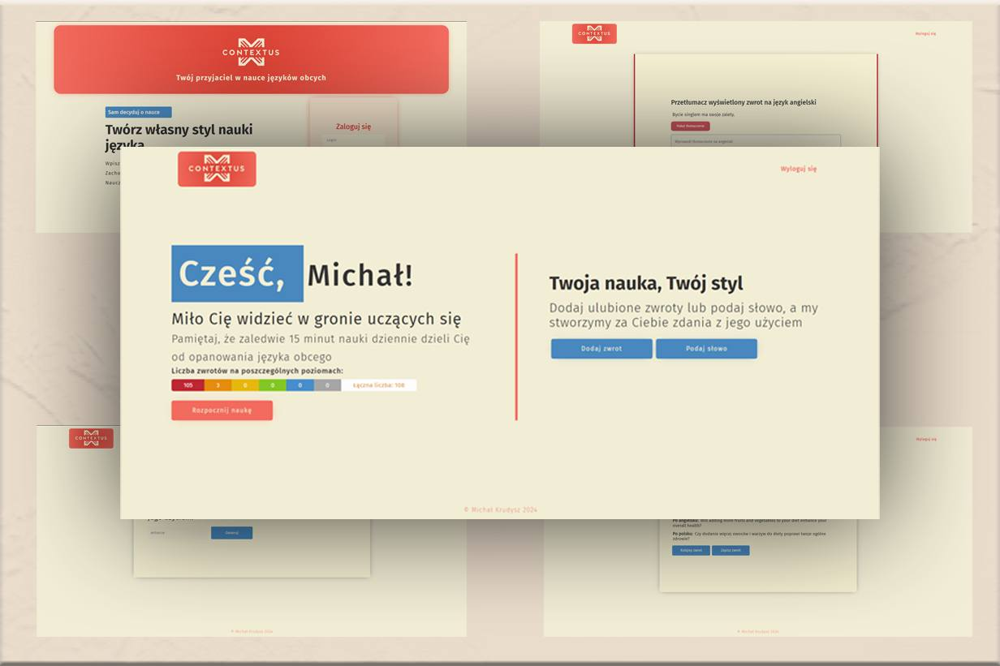

### Information about Cookies displayed on the first page load

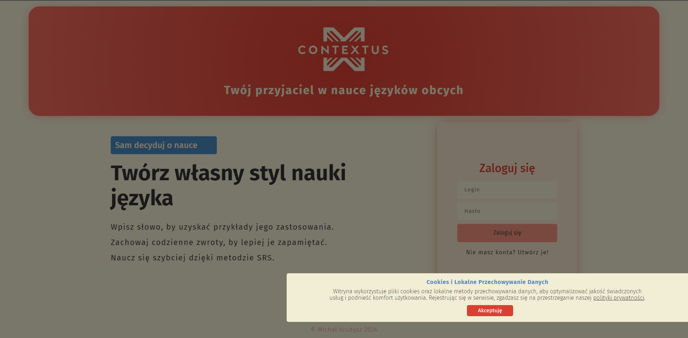

### A modal appearing with details of the privacy policy

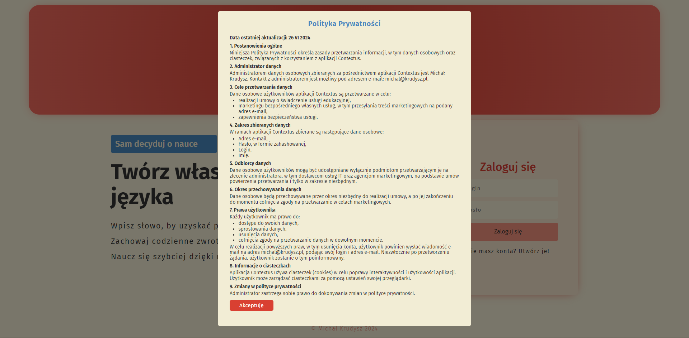

### Homepage with login

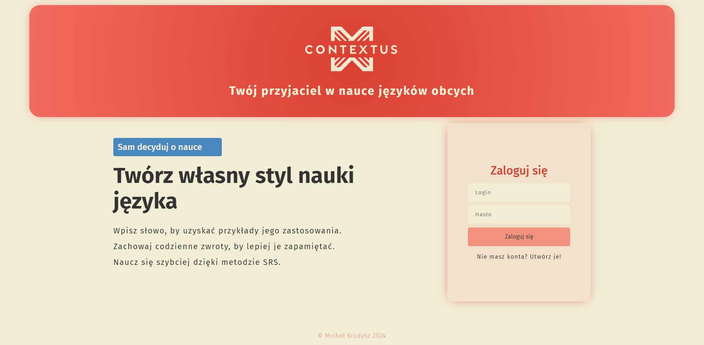

### Homepage with registration

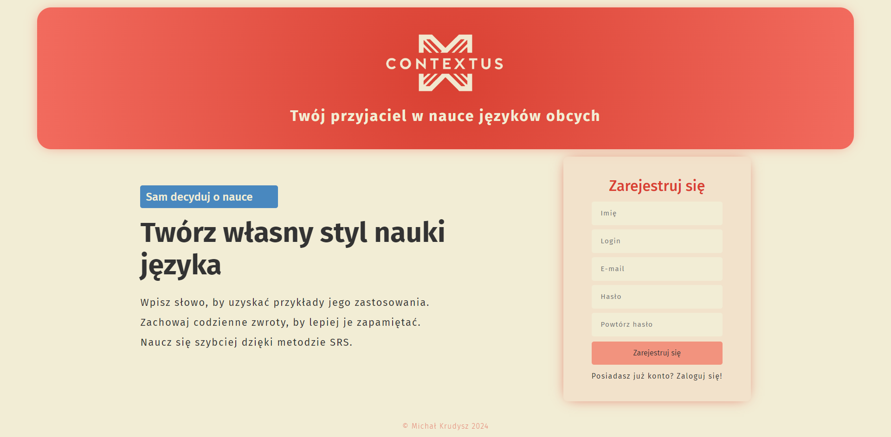

### Email verification

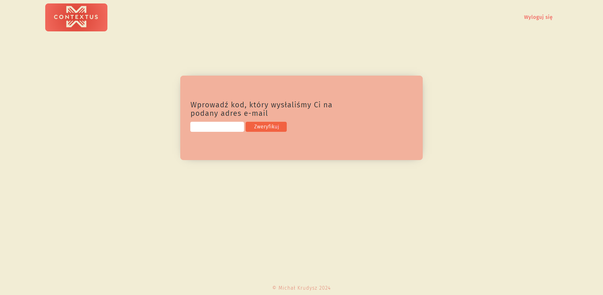

### Dashboard

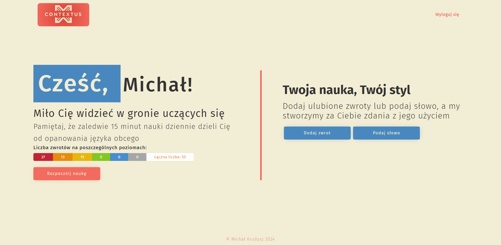

### Phrase generation word input form

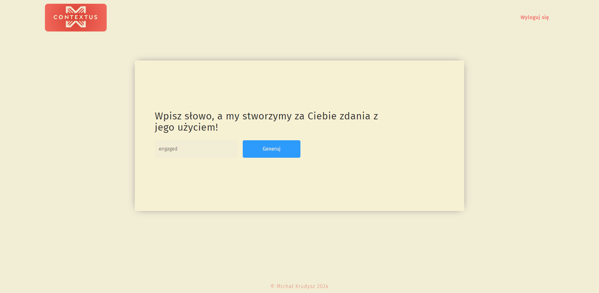

### Screen waiting for generated phrases

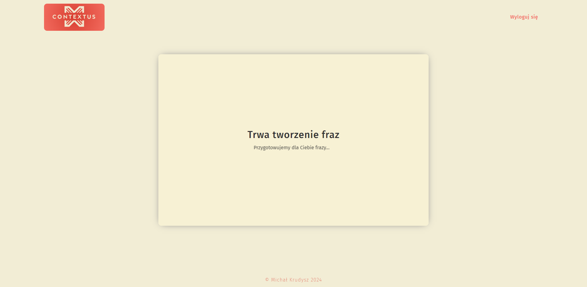

### A screen showing generated phrases

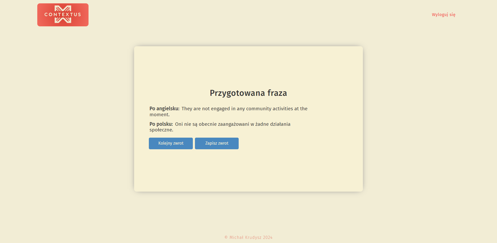

### Manual phrase entry form

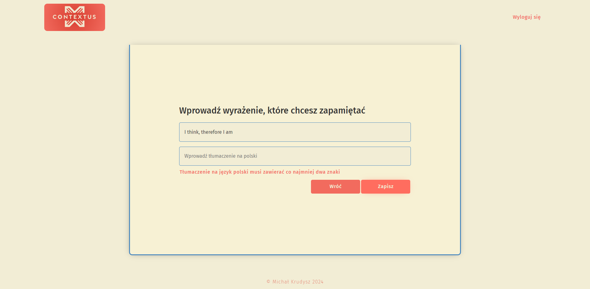

### Spaced repetition learning module

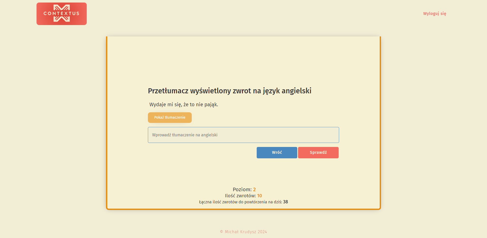

## Pre-installation Requirements

A Node.js environment is required to run the application locally. The project consists of multiple components that need to be set up and run in separate terminals:

### Setting up the project:

1. **Clone the project repository.**

### Client setup:

2. Navigate to the `client` directory and run `npm install` to install dependencies.
3. To start the frontend application in development mode, open a terminal window and execute `npm run dev`.
   - In the `client/config` directory, the default API base URL is configured as:
     ```javascript
     export const API_BASE_URL = "http://localhost:3000";
     ```
     Change this value if you wish to deploy the application to a production server.

### Server setup:

4. Navigate to the `server` directory and run `npm install` to install server dependencies.
5. Install and configure RabbitMQ for queue management in the application.
6. To start the backend application in development mode, open another terminal window and execute `npm run dev`.

### Database setup:

7. Ensure that the MySQL database is set up as described in the `database` directory files. The database can be created using tools like MySQL Workbench.

### Note:

Both the client and the server must be running concurrently in separate terminal windows for the application to function properly.
